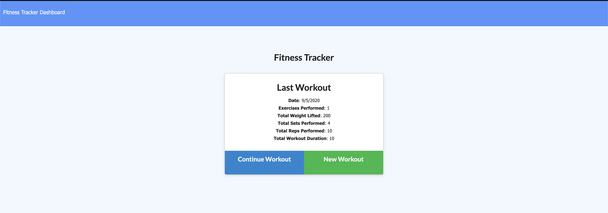

# Workout Tracker

This workout tracker app allows you to track you workouts by adding resistance and cardio exercises to a workout for a particular day. It also has the ability to display statistics for your workouts during the past week. The application is running on node and mongo and hosted on heroku. you can try the app here: https://fitness-tracker-22248.herokuapp.com/

